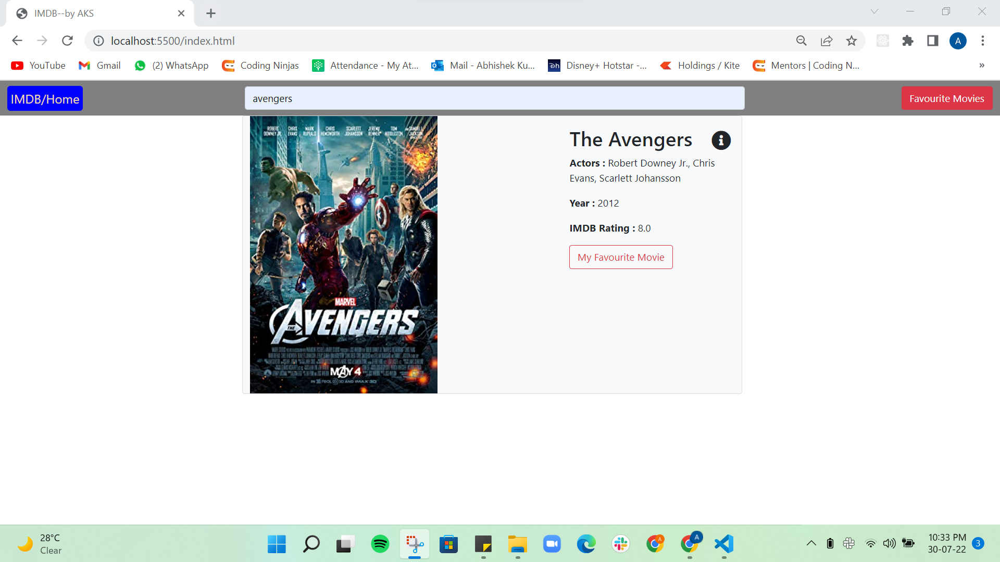
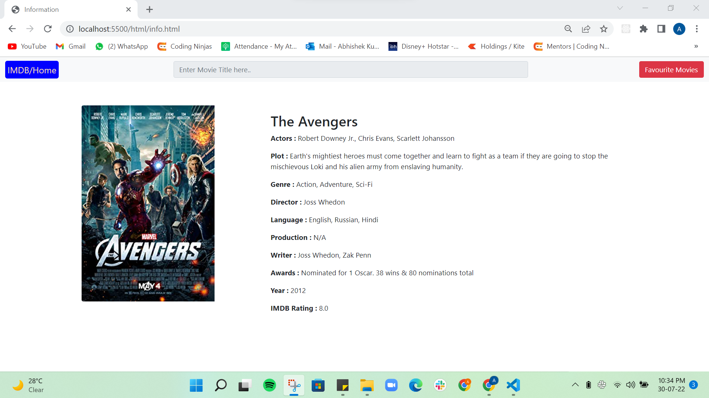
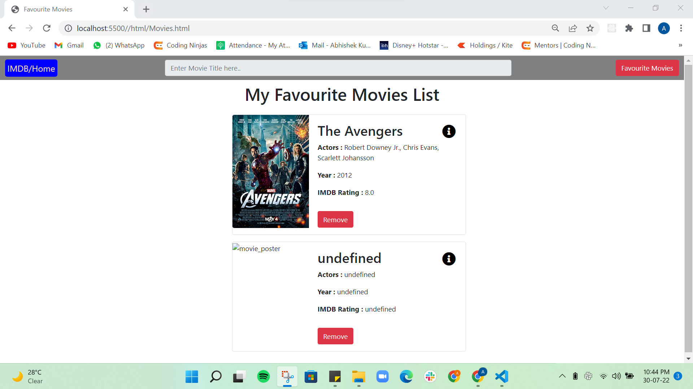

# IMDB

### View this web page at : https://abhishek2396.github.io/imdb/

## Features

* Home Page
  1.  Search any movie in the home page search bar {as you type the search results updates, just like Google does for suggestions}.
  2.  Each search result of the movie has a favourite button, clicking on which the movie is added to “My favourite movies page”.
  3.  On clicking any particular search result (any movie), A new page with more information about that movie is open.

* Movie Page
  1. It shows information about the movie like its name, photo, plot, etc.

* My Favourite Movie Page
  1.  Display a list of all the favourite movies.
  2.  It can have the same number of movies before and after closing the browser/refreshing the browser.
  3.  Remove from favourites button: Each movie has been removed from the favourites button, clicking on which movie was removed from the list.

## Previews

* Home Page

  

* Movie Page
  
  
  
* My Favourite Page
  
  
